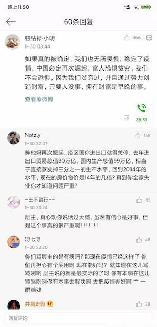
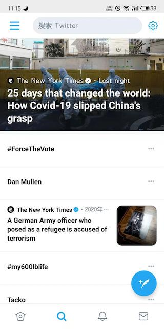
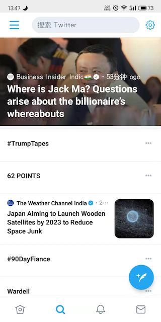
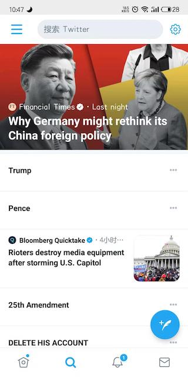
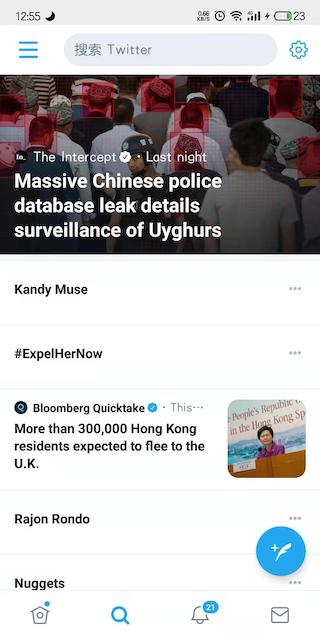

> **有效期: *12* 个月**  *[什么是有效期?](https://blog.timvel.com/2020/12/28/12-28-2020-a-description-of-the-validity-period/)*

### 一年前

自疫情开始快一年多了, 中国控制的不错, 回想起去年这个时间段, 感觉很好笑.

第一件比较大的事情是, 当时WHO要评定中国是否为疫区国, 当时全网都在科普这会带来的后果, 但凡你抱有乐观心态, 就会有一群网友跳出来给你科普. 现在想来, 实在好笑, 可能他们已经被美国贸易战吓破了胆. 

禁止中国出口, 恐怕应该担心的是全世界. 很多中国人甚至对中国一无所知.

快过年的时候, 我从上海返乡, 我的同事留沪继续工作, 当时我还跟他们说, 不要紧, 上海是中国最安全的城市, 哪怕全中国沦陷, 上海也不会沦陷. 

我的判断来自于上次大流行中上海的情况, 还有对技术的判断, 完全可以通过人脸识别, 链接所有摄像头, 可以轻易跟踪患者行踪. 也可以让阿里, 腾讯交出他们的数据, 我相信这两家企业在不断追踪用户行踪. 再加上中国人民普遍接受隔离政策, 过年期间上海人流量骤减, 留沪显然是更好的选择.但是我的同事显然更愿意相信Twitter等他们熟悉的媒体, 逃离了中国, 去了泰国, 然后回了意大利. 后来的事情也是十分好笑的, 起初还问我需不需要口罩. 

当然, 当时外网上对中国的揣测也是十分好笑, 老外们在外媒的影响下, 天然的不相信中国, 认为共产党是邪恶的, 一定会隐瞒真实的感染人数. 他们也确实拿出的似是而非的"证据", 甚至用数学建模的手段证实了他们的言论. 朋友圈中一些身处国外的, 或者有翻墙能力的人, 不停的转载那些消息, 似乎是表达对墙内人的怜悯, 毕竟他们才是接触真相的人啊.

其中最好笑的一个消息是, 某哈佛教授通过计算得出, COVID-19的传染系数高达3.4(记不清了), 远高于SARS的2.3. 于是推测出武汉的真实感染人数可能高达数百万, 或者数千万. 当然现在大家都知道了哪些国家有上百万的感染人数. 我对这些消息怎么看呢? 它们可能是真的, 可能是假的, 但是我不在乎, 因为就算这次疫情再严重, 在足够长的时间线中, 它也只是一次小波动. 

哦, 忘了一个重要人物, 李文亮, 被外媒捧为中国的吹哨人, 因为他在朋友圈中说武汉发现了SARS, 被警方以造谣逮捕了, 后来签了个保证书释放了. 问题就在于, 网友们认为这不是造谣, 这是"吹哨", 如果官方听了, 疫情就可以得到更好的控制. 

当然对于外媒来说, 他们更在乎"被抓"这个细节. OK, 现在好好的理理这个事情, 我先说我的看法, 那就是, 我对李文亮这个人毫无感觉. 每天无数人死去. 然后这件的事情的问题在于, 在重大公共安全事情发生的时候, 公众有没有知情权? 他们在什么时间可以知道?

对于这两个问题的回答是, 大多数有, 该让你知道的时候会让你知道.

李文亮的问题在于, 作为一名医生, 将医院发生的事情直接公布给了亲友. 可能他的出发点是好的. 但作为亲人, 在他朋友圈看到这条消息的人会更倾向于选择相信, 于是也会转发到自己朋友圈, 那么武汉发现SARS这条信息开始以光速传播, 消息来源于我朋友, 我同事. 如果彻底传播开, 很容易造成公众恐慌, 身处武汉的感染者会更快的逃离武汉, 将病毒传播到全国, 甚至世界各地. 我想这也是国家很快决定封城的原因, 即便如此, 仍有很多人在封城前逃离武汉, 什么武汉一家子通过关系跑到上海直接确诊, 这类消息散布全网, 真真假假.

所以呢? 各行各业都有自己的职业道德, 尽管这些标准的约束不一致, 有些是通过员工自觉, 有些是签署条款, 通过法律约束. 很多时候, 人们总是嚷嚷着要真相, 但却无法保证自己面对信息时能保持理性和判断. 

当一个天文学家看到一颗陨石冲向地球, 他是不能告诉大家的. 如果地球一个月后毁灭, 我相信那些一无所有的人会无所顾虑的去犯罪. 如果地球一天后毁灭, 那么大概一般人会死在陨石到来前. 当公众开始恐慌, 社会失去秩序, 那么就会有人死在人群的不理性中. 

我当然不期待傻逼网友们能够理解, 他们只会嚷嚷着要知道真相, 却没有足够的理性来接纳真相. 

### 民主

民主是什么? 对于这类诞生于人类, 脱离自然的名词, 我通常难以理解. 如果需要解释, 搜索引擎就可以给出, 如果谈到人们提起这个词所诉求的东西, 那就不好说了. 所有, 问题不在于你需不需要民主和自有, 而是你的诉求是什么, 你需要得到些什么才能停止哔哔.

最为人们津津乐道的就是西方民主, 当然西方国家标榜自己的人民是民主的, 统治阶级是民主的. 那么就看看他们有什么, 较高的工资水平, 大house, 某些发达国家的某些物品价格低廉(特指美国的肉类, 欧洲物价可不低), 好像开放的网络(对西方人民开放, 对特定国家的IP, 会严格监控言论, 推送国家的负面信息, 没错,就是Google, Twitter, Facebook), 可以对执政党指指点点. 

那么将这些东西排排序, 非西方国家,追求民主的人民, 他们的主要诉求是什么呢? 当然是收入, 如果他们在本国就能获得较高的收入, 又怎么会去关心物价的细微差别, 至于网络上的屏蔽词, 以中文的超高灵活性, 完全可以通过同音字, 加偏旁的生僻词来代替. 翻墙, 访问外网, 也不是多困难的事. 可以假定, 追求民主和自由的人, 只是追求可以满足自身感性欲望的物质水平. 

这是个庞大而复杂的体系, 是政权为了控制人民苦思冥想编撰的故事, 深究到底得到的东西也只是人类创造的哲学, 毫无意义. (暂时无法将思绪整理成语言, 以后有机会再说吧)

这里说结论, 所谓民主, 自由, 就是一个国家政权希望它的人民所成为的样子, 它允许或不允许人民谈论政党, 关心政治, 关心环境, 一切的一切都取决于那个政权是怎么希望的. 一切的社交平台都是国家宣传机器, 国家通过控制信息, 来引导人民. 你相信Facebook, Twitter, 微博... 你相信你看到的信息, 这不重要, 你只是选择相信某个国家宣传机器. 但不要觉得自己看到了真相, 可以对另一个国家宣传机器下的人民指指点点.

我打开Twitter的时候, 大多数情况下, 我都能看见关于中国的新闻被置顶. 这是对所有用户的推送呢? 还是对指定IP的用户推送? 我关注列表都是机器学习的专家, 科学博主, 我喜欢的歌手, 还有白宫. 至少和我的浏览习惯是毫不相干的. 这不过是国家宣传机器的一部分罢了.

### 趋势

我为什么不担心疫情的影响? 从人类发展规律来看, 下一个阶段必定有一个10亿人口的国家成为超级大国, 并且与第二梯队国家的差距会大大超过美国时代的差距. 不管那些坚称印度会成为下一个超级大国的人, 那么就剩中国了.

客观方面, 很多人也分析过了, 什么中国是地球上最大的工业国, 有全部工业体系等. 虽然也有人唱衰, 拿芯片, 可回收火箭等技术, 说差距至少50年.

当然这些都不重要, 重要的是人口和氛围, 中国仍处在上升阶段, 未来还有大量的理工人才. 这些人才足以服务地球, 一个关键技术的人才可以服务成千上万人. 地球上大部分人的生活水平还很低下, 美国做超级大国, 只能服务10亿人口, 但美国人口还远达不到10亿, 所以需要大部分国人从事普通的工作. 因为如果所有人都做技术工作, 产能会过剩. 而中国要做超级大国的话, 举个极端的例子, 所有人都做程序员, 所有人都月收入过万, 但这不现实. 因为人们不需要这么多App, 没有足够的用户吸收这些人才的产出. (抱歉, 语言组织有些问题, 无法表达我的想法, 就这样吧.)

结论就是, 未来中国人才的产能可以供给全世界, 每个人都能做高收入的工作, 但前提是要全世界的人口都有能力消费. 这是一定会达到的终点, 至于中间发生了什么, 是通过一带一路, 还是通过疫情的摧残, 或者什么其他手段, 战争也好, 外交也好, 这些都不重要. 重要的是趋势, 中间发生了什么, 都是后人才需要学习的历史. 

## EN
